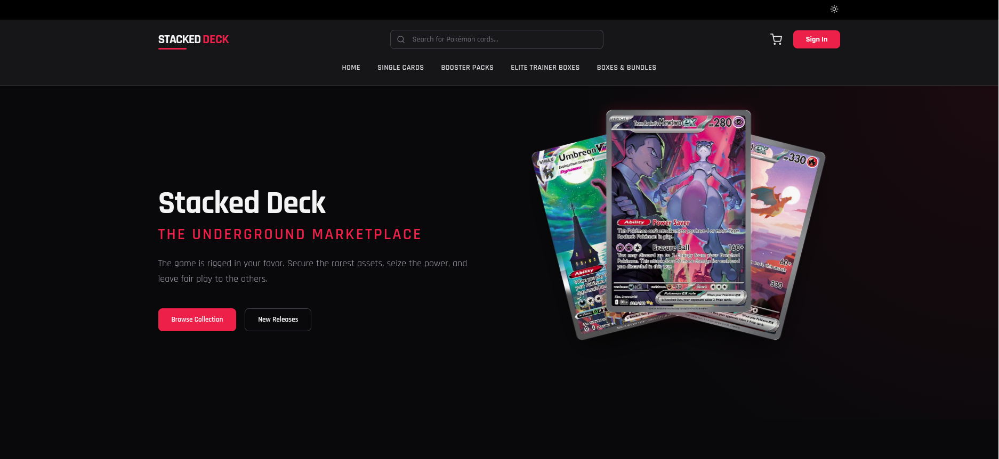
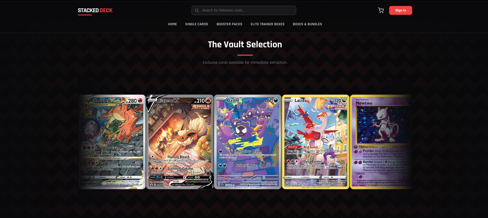
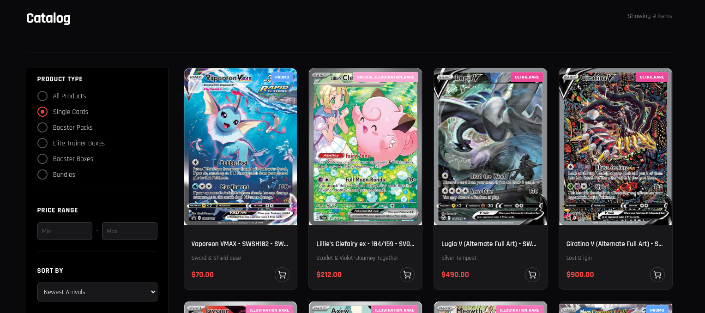
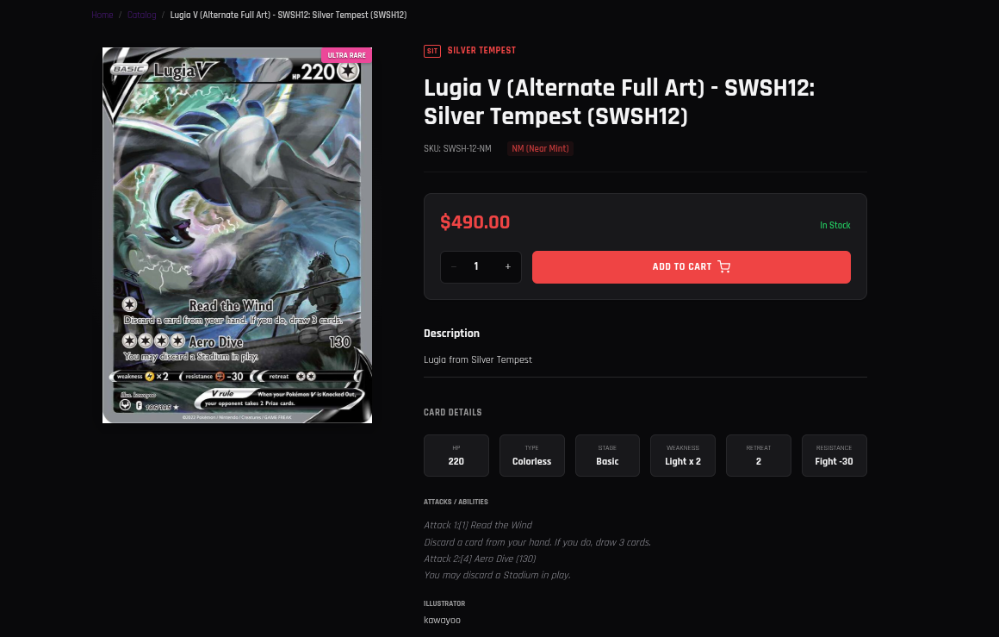
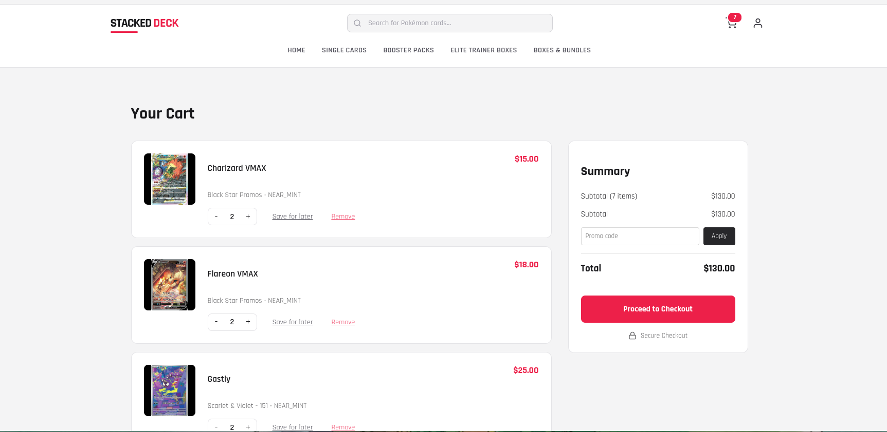
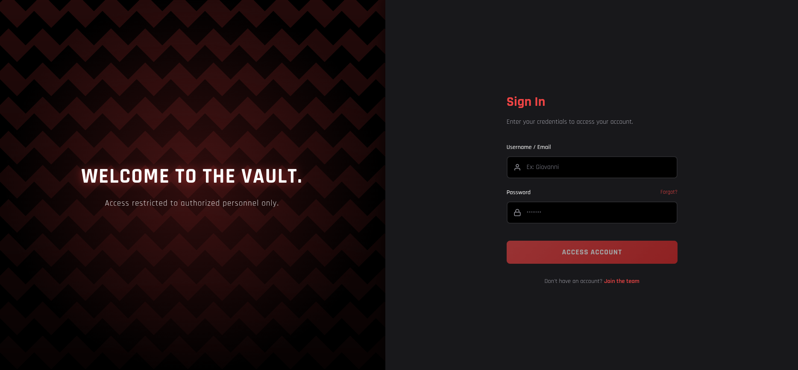
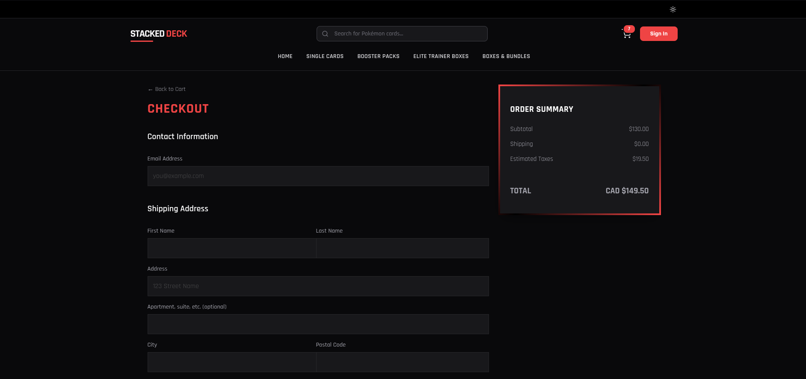
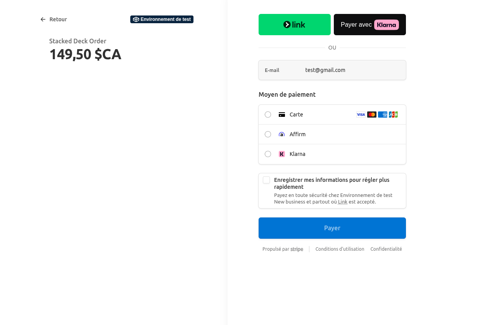

# 🃏 Stacked Deck - Client Web


**Stacked Deck Client** est l'interface frontend moderne et réactive de la marketplace *Stacked Deck*. Développée avec **Angular**, cette application offre une expérience utilisateur fluide ("SPA") pour l'achat et la collection de cartes Pokémon TCG, avec une esthétique "Dark Mode" immersive.

Elle communique avec l'API Java Spring Boot pour gérer le catalogue, les utilisateurs et les commandes.

---

## 📑 Table des Matières

- [Aperçu Visuel (Parcours Utilisateur)](#-aperçu-visuel)
- [Fonctionnalités Clés](#-fonctionnalités-clés)
- [Technologies & Stack](#-technologies--stack)
- [Installation et Démarrage](#-installation-et-démarrage)
- [Structure du Projet](#-structure-du-projet)

---

## 📸 Aperçu Visuel

Bienvenue dans *The Underground Marketplace*. Voici un tour d'horizon de l'application.

### 🏠 1. Accueil & Immersion
La page d'accueil plonge l'utilisateur dans l'univers de la marque avec une mise en avant des produits phares ("Vault Selection") et une navigation intuitive.


*L'écran d'accueil avec le Hero Banner et l'identité "Underground Marketplace".*


*La "Vault Selection" : un carrousel interactif des cartes les plus exclusives.*

---

### 📂 2. Navigation par Catégories
L'utilisateur peut naviguer rapidement entre les différents types de produits (Cartes à l'unité, Boosters, ETB, Bundles).


---

### 🛍️ 3. Catalogue & Recherche Avancée
Le catalogue propose des outils de filtrage puissants (Prix, Type de produit, Tri) pour trouver la perle rare.



---

### 🔍 4. Détails Produit
Chaque carte possède une fiche détaillée permettant de choisir l'état de la carte (Near Mint, Played, etc.) avant l'ajout au panier.



---

### 🛒 5. Panier & Commande
Gestion complète du panier avec ajustement des quantités, application de codes promo et récapitulatif avant paiement.



---

### 🔐 6. Authentification Sécurisée
L'accès aux fonctionnalités de compte et au paiement nécessite une authentification sécurisée.


*Page de connexion "Welcome to the Vault".*

---

### 💳 7. Paiement & Checkout
L'application intègre un tunnel de paiement complet et sécurisé via **Stripe**.

| Checkout | Paiement Stripe |
| :---: | :---: |
|  |  |
| *Validation de l'adresse et expédition* | *Saisie sécurisée des coordonnées bancaires* |

---

## 🚀 Fonctionnalités Clés

* **Design Responsive & Dark Mode :** Interface soignée adaptée aux collectionneurs.
* **Filtrage Dynamique :** Tri et recherche instantanée dans le catalogue.
* **Gestion d'État (State Management) :** Utilisation de RxJS pour une synchronisation temps réel du panier et de l'authentification.
* **Intégration Stripe :** Paiement sécurisé avec gestion des intents côté client.
* **Espace Membre :** Historique de commandes et gestion de profil.

---

## 🛠 Technologies & Stack

* **Framework :** Angular (Dernière version stable)
* **Langage :** TypeScript
* **Style :** SCSS (Sass) / HTML5
* **Http Client :** RxJS (Observables)
* **Paiement :** Stripe.js / Ngx-Stripe

---

## 💻 Installation et Démarrage

Ce projet nécessite [Node.js](https://nodejs.org/) et [Angular CLI](https://angular.io/cli).

1.  **Cloner le dépôt :**
    ```bash
    git clone [https://github.com/0xAdafang/Stacked_Deck_Client.git](https://github.com/0xAdafang/Stacked_Deck_Client.git)
    cd Stacked_Deck_Client
    ```

2.  **Installer les dépendances :**
    ```bash
    npm install
    ```

3.  **Lancer le serveur de développement :**
    ```bash
    ng serve
    ```
    L'application sera accessible sur `http://localhost:4200/`.

---

## ⚙️ Configuration

Les variables d'environnement (URL de l'API, Clé publique Stripe) sont gérées dans le dossier `src/environments/`.

* `environment.ts` (Développement)
* `environment.prod.ts` (Production)

Exemple :
```typescript
export const environment = {
  production: false,
  apiUrl: 'http://localhost:8080/api',
  stripePublicKey: 'pk_test_...'
};

<hr>
<p><em>Développé par <a href="https://github.com/0xAdafang">0xAdafang</a></em></p>
